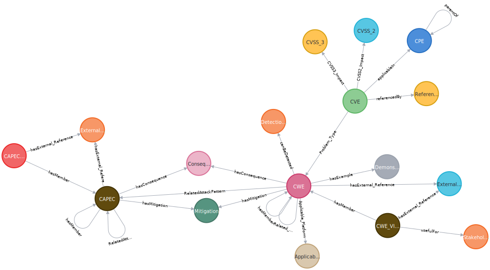

# GraphKer
Open Source Tool - Cybersecurity Graph Database in Neo4j


**|G|r|a|p|h|K|e|r|**

 { open source tool for a cybersecurity graph database in neo4j }

With GraphKer you can have the most recent update of cyber-security vulnerabilities, weaknesses, attack patterns and platforms from MITRE and NIST, in an very useful and user friendly way provided by Neo4j graph databases!

# **Data model**



# **Prerequisites**

_3 + 1 Steps to run GraphKer Tool_

### **1) Download and Install Neo4j Desktop**
   - Windows Users: https://neo4j.com/download/
     
     Create an account to get the license (totally free), download and install Neo4j Desktop.
     
     Useful Video: https://tinyurl.com/yjjbn8jx
   - Linux Users:
   
      ```
      sudo apt update
      sudo apt install apt-transport-https ca-certificates curl software-properties-common
      curl -fsSL https://debian.neo4j.com/neotechnology.gpg.key | sudo apt-key add -
      sudo add-apt-repository "deb https://debian.neo4j.com stable 4.1"
      sudo apt install neo4j
      sudo systemctl enable neo4j.service
      sudo systemctl status neo4j.service
      ```
      
      You should have output that is similar to the following:
      ```
      ● neo4j.service - Neo4j Graph Database
     Loaded: loaded (/lib/systemd/system/neo4j.service; enabled; vendor preset: enabled)
     Active: active (running) since Fri 2020-08-07 01:43:00 UTC; 6min ago
     Main PID: 21915 (java)
     Tasks: 45 (limit: 1137)
     Memory: 259.3M
     CGroup: /system.slice/neo4j.service
     . . .
     ``` 
     Useful Video: https://tinyurl.com/vvpjf3dr
     
### **2) Create and Configure the Database**
   - Create Database:
     - Windows Users:
       
       You can create databases in whatever version you want (latest version preferable) through GUI or Neo4j Terminal.
       - Create a new database in GUI: Just click the (+), set DB Name, Username and Password. Useful Tutorial: https://www.sqlshack.com/getting-started-with-the-neo4j-graph-database/
       - Through Neo4j Shell: https://neo4j.com/docs/cypher-manual/current/databases/
     - Linux Users: When you start neo4j through systemctl, type ``` cypher-shell ```, then ``` create database NAME; ```. Now you have to set this database, as default so when you start neo4j you start automatically this database. Go to /etc/neo4j/neo4j.conf and uncomment ``` dbms.default_database=neo4j ``` and change it with your new database name. Restart neo4j service and you are ready. 
   - Configure Database:
     - Install APOC Plugin:
       - Windows Users: In Neo4j Desktop Main Page --> Choose your Database --> Click Plugins --> APOC --> Install
       - Linux Users:
         - Download APOC jar File: https://github.com/neo4j-contrib/neo4j-apoc-procedures/releases (*-*-all.jar file)
         - Place it in Plugins Folder --> check every folder path in Neo4j: https://neo4j.com/docs/operations-manual/current/configuration/file-locations/
         - Modify the Database Configuration File to approve apoc procedures.
           
           Uncomment: ``` dbms.directories.plugins=plugins ```
           
           Uncomment and Modify:
           ```
            dbms.security.procedures.unrestricted=apoc.*
            dbms.security.procedures.whitelist=apoc.*,apoc.coll.*,apoc.load.*
            #loads unrestricted and white-listed procedures/plugins to the server
           ```
           
           Restart Neo4j: ```systemctl restart neo4j```
     - Configure Database Settings File:
       - Windows Users: In Neo4j Desktop Main Page --> Choose your Database --> ... (Three Dots) --> Settings --> Go to last line and set the commands below --> Apply and Restart the Database
        
         ```
         apoc.export.file.enabled=true
         apoc.import.file.enabled=true
         apoc.import.file.user_neo4j_config=false
         cypher.lenient_create_relationship = true
         ```
         
       - Linux Users: Same as above, in the neo4j.conf file --> check every folder path in Neo4j: https://neo4j.com/docs/operations-manual/current/configuration/file-locations/

     - Configure Memory Usage:
       
       In Neo4j Configuration File (neo4j.conf):
       You can run GraphKer with only 1G of Heap and 512M of pagecache
       ```
       dbms.memory.heap.initial_size=512M
       dbms.memory.heap.max_size=1G
       dbms.memory.pagecache.size=512M
       ```
       
### **3) Install requirements.txt**
   - GraphKer Uses: xmltodict, neo4j, requests, beautifulsoup4
   - ``` pip install -r requirements.txt ```    

### **4) Install Applications Created for Neo4j**
   - There are several applications created especially for Neo4j that you can use for better experience and work.
     - Neo4j Bloom: Application for better graph presentations. Free and Easy to use.
     - Graphlytic: Third-Party App, better graph presentations, but most important auto-analytics and statistics. Free and Paid Editions. We can do the most locally with free edition. Learn More: https://graphlytic.biz/
     - Neo4j Database Analyzer: Third-Party App, Free, provides great analysis tools for our Data and our Schema. Learn More: https://community.neo4j.com/t/introducing-the-neo4j-database-analyzer/6197

# **Run GraphKer**

```
// Default
python main.py -u BOLT_URL -n USERNAME -p PASSWORD -d IMPORT_PATH
// Run and Open Neo4j Browser
python main.py -u BOLT_URL -n USERNAME -p PASSWORD -d IMPORT_PATH -b y
// Run and Open Graphlytic App
python main.py -u BOLT_URL -n USERNAME -p PASSWORD -d IMPORT_PATH -g y
// Default Run Example in Ubuntu
sudo python3 main.py -u BOLT_URL -n USERNAME -p PASSWORD -d /var/lib/neo4j/import/
``` 

_Default Bolt URL for Neo4j: bolt://localhost:7687_

_Default Username in Neo4j Databases: neo4j_

_For Neo4j Import Folder check the link above with File Locations._

Estimated RunTime: **6-15 Minutes**. Depends on hardware.

_**At least 8GB in your hard drive.**_

#
You can check out an existing example of the graph database that GraphKer creates. Just download the dump file from repo: https://github.com/amberzovitis/GraphKer-DBMS-Dump and import it to an existing or new graph database in Neo4j. This file consists of CVEs from 2021 (with related CPEs) and all CWEs and CAPECs.

#

You can access the CVE and CPE Datasets in National Vulnerability Database by NIST (https://nvd.nist.gov/vuln/data-feeds), CWE Dataset in MITRE (https://cwe.mitre.org/data/downloads.html) and CAPEC Dataset in MITRE (https://capec.mitre.org/data/downloads.html).

# 
--Search, Export Data and Analytics, Enrich your Skills--

**Created by Adamantios - Marios Berzovitis, Cybersecurity Expert MSc, BSc**

_Diploma Research - MSc @ Distributed Systems, Security and Emerging Information Technologies | University Of Piraeus --> https://www.cs.unipi.gr/distributed/_

_Co-Working with Cyber Security Research Lab | University Of Piraeus --> https://seclab.cs.unipi.gr/_

Facebook: https://www.facebook.com/GraphKerTool/

LinkedIn: https://tinyurl.com/p57w4ntu

Github: https://github.com/amberzovitis

Enjoy! Provide Feedback!
